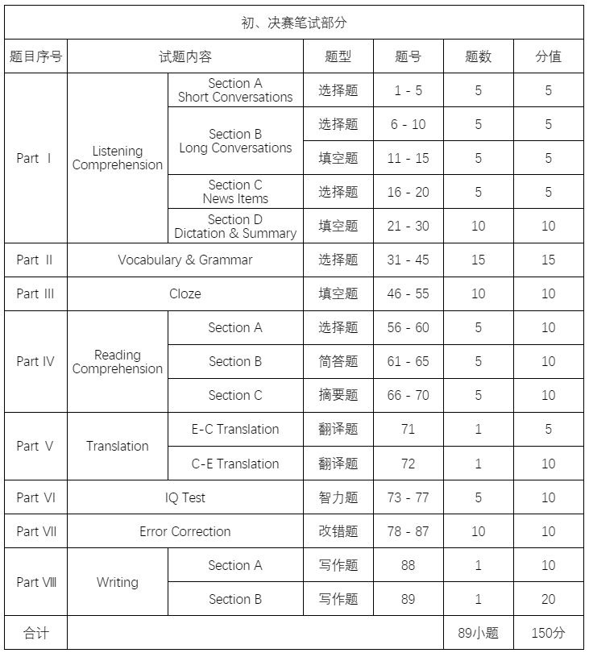
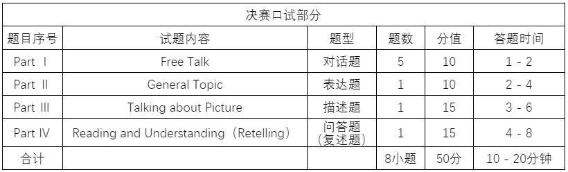

# 全国大学生英语竞赛
## 参赛对象
NECCS分为A、B、C、D四个类别：

| 类别 | 参赛对象 |
| -- | -- |
| A | 研究生 |
| B | 英语专业本、专科学生 |
| C | 非英语专业本科生 |
| D | 体育类、艺术类本科生和非英语专业高职高专类学生 |

## 赛事流程
### 初赛
1. 全国统一时间进行考试；
2. 报名时间大概为十二月到三月；
3. 每年四月得第二个星期日举行；
4. 初赛形式为笔试（含听力），比赛时间为120分钟，满分150分。

### 决赛
1. 全国统一时间进行考试；
2. 报名时间大概；
3. 每年五月的第二个星期日举行；
4. 决赛形式为笔试和口试（竞赛组委会根据具体情况选择是否进行口试），笔试时间为120分钟，满分150分；口试时间约为20分钟，满分50分。

### 总决赛
1. 每年暑假期间举行；
2. 在决赛中获得特等奖或校级成绩第一名的参赛者，方可报名，竞赛组委会也可推荐获得一等奖且英语口语方面突出的学生参加总决赛；
3. 总决赛中主要赛事为英语演讲比赛、英语风采大赛和英语辩论赛。

### 注意事项
受到疫情影响，部分赛区将于下半年举行初赛。决赛、总决赛的举行也推迟到下半年。所以具体报名时间等信息查看[官网](http://www.chinaneccs.cn/pages/index/index "全国大学生英语竞赛官网")。

## NECCS题型及分值划分

